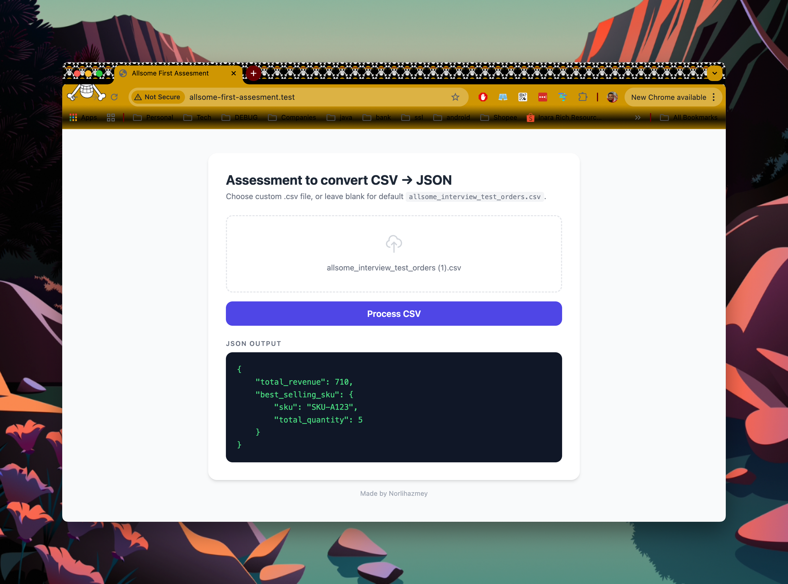
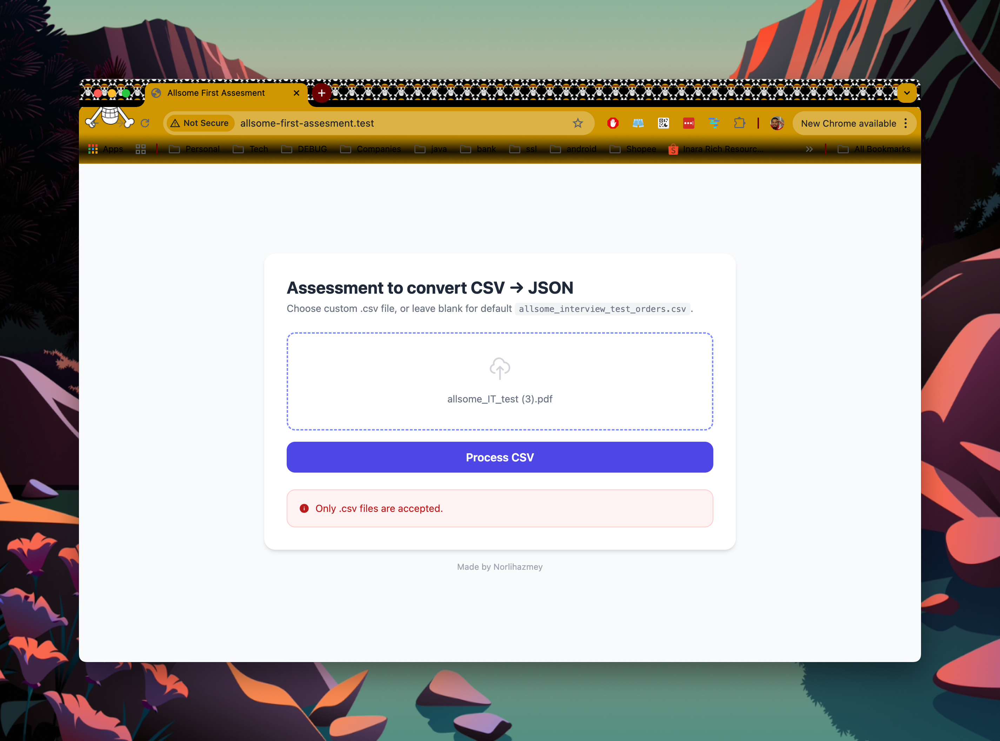
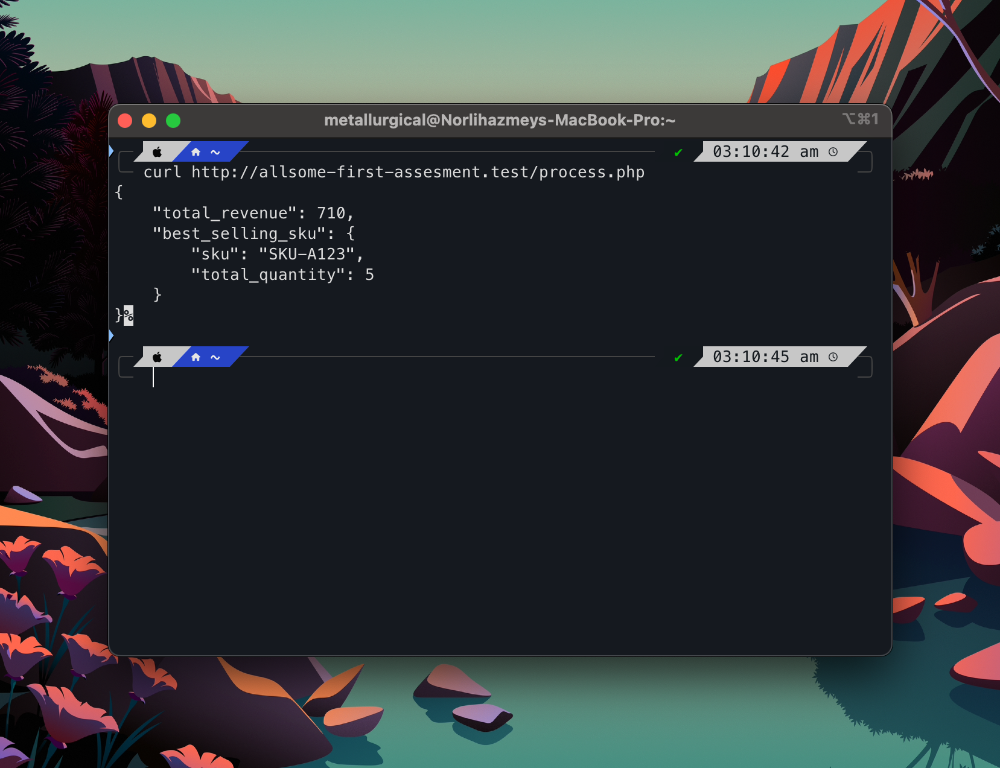

# Allsome First Assement

A simple PHP web app that reads from CSV file, calculates total revenue and best-selling SKU, and displays the result as JSON.

## Requirements

- PHP 8.0+
- Composer
- Laravel Herd (optional)

## Installation

```bash
git clone git@github.com:metallurgical/allsome-first-assesment.git
cd allsome-first-assesment
composer install
```

## Running the app

**Option 1 — PHP built-in server**

```bash
php -S localhost:8080
```

Then open `http://localhost:8080` in your browser.

**Option 2 — Laravel Herd**

```bash
herd link allsome-first-assesment
```

Then open `http://allsome-first-assesment.test` in your browser.

**Option 3 — curl(terminal)**

```bash
php -S localhost:8080
```

<!-- > Replace `localhost:8080` above with your own host (e.g. `allsome-first-assesment.test` for Herd, or your localhost name). -->

Use the default CSV:

```bash
curl http://localhost:8080/process.php
```

Upload your own CSV file:

```bash
curl -F "csv=@/path/to/your/file.csv" http://localhost:8080/process.php
```

## CSV format

The app expects a CSV with these columns:

```
order_id,sku,quantity,price
1001,SKU-A123,2,50.0
1002,SKU-B456,1,120.0
1003,SKU-A123,3,50.0
1004,SKU-C789,5,20.0
1005,SKU-B456,2,120.0
```

Default file (`allsome_interview_test_orders.csv`) is included so no need to use your own file. You can also upload your own CSV using import file.

## Output

**Success** — returns total revenue and the best-selling SKU by quantity:



```json
{
    "total_revenue": 710.00,
    "best_selling_sku": {
        "sku": "SKU-A123",
        "total_quantity": 5
    }
}
```

**Error** — displayed inline when the file is invalid (e.g. wrong file type, missing columns, bad data):



**curl** — terminal output:


